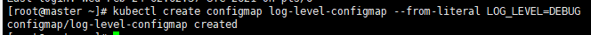
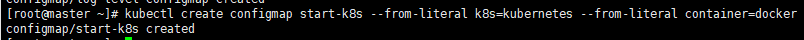
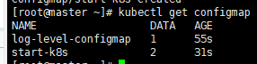
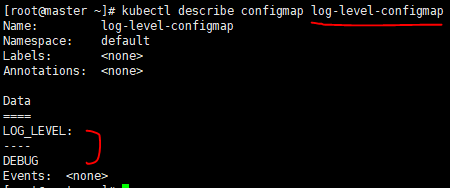
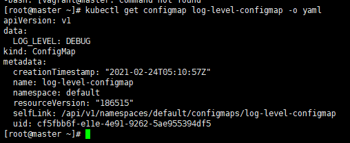
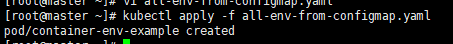
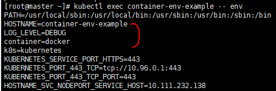
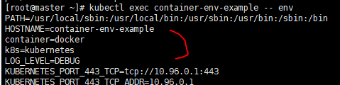
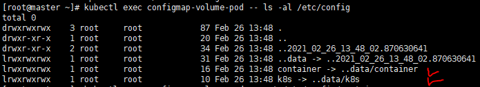
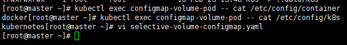

## Configmap

컨피그맵은 설정 값을, 시크릿은 노출되면 안되는 비밀 값을 저장


**컨피그맵 생성 방법**

- yaml 파일을 이용해서 생성
- `kubectl create configmap` 명령어로 생성  


```
kubectl create configmap log-level-configmap --from-literal LOG_LEVEL=DEBUG
```




```
kubectl create configmap start-k8s --from-literal k8s=kubernetes --from-literal container=docker
```

* --from-literal: key-value 형식의 정보를 저장할 수 있게 한다.




**컨피그맵 확인**

````
[vagrant@master ~]$ kubectl get configmap
````



* 설정한거 갯수


```
[vagrant@master ~]$ kubectl describe configmap log-level-configmap
```




```
[vagrant@master ~]$ kubectl get configmap log-level-configmap -o yaml
```

* describe해서 조회해도되고 get으로 조회해도 된다.




* 컨피그맵도 설정정보들을 그룹핑해서 별도로 나눌 수 있다.


----

**포드에서 컨피그맵을 사용하는 방법1. 컨피그맵의 값을 포드 내부의 환경변수로 사용**

---

1. envForm: 컨피그맵에 정의된 모든 키=값 쌍을 가져와서 환경변수로 설정

2. valueFrom, configMapKeyRef : 컨피그맵에 존재하는 키=값 쌍중에서 원하는 데이터만 선택해서 환경변수로 설정

   

***envForm: 컨피그맵에 정의된 모든 키=값 쌍을 가져와서 환경변수로 설정***


1. **YAML 파일을 작성**

```
[vagrant@master ~]$ vi all-env-from-configmap.yaml
```

```yaml
apiVersion: v1
kind: Pod
metadata:
  name: container-env-example
spec:
  containers:
    - name: my-container
      image: busybox
      args: ['tail', '-f', '/dev/null']
      envFrom:						# 컨피그맵에 정의되어 있는 모든 키=값 쌍을 가져와서 환경변수로 설정
      - configMapRef:
          name: log-level-configmap 
      - configMapRef:
          name: start-k8s
```

* envForm => configMapRef


2. **포드를 실행**

```
[vagrant@master ~]$ kubectl apply -f all-env-from-configmap.yaml
```




3. **컨테이너 환경 변수를 확인 (진입이 아니라 확인)**

```
[vagrant@master ~]$ kubectl exec container-env-example -- env
```



* 위에서 설정한 configmap


----

***valueFrom, configMapKeyRef : 컨피그맵에 존재하는 키=값 쌍중에서 원하는 데이터만 선택해서 환경변수로 설정***


1. **YAML 파일을 작성**

```
[vagrant@master ~]$ vi selective-env-from-configmap.yaml
```

```yaml
apiVersion: v1
kind: Pod
metadata:
  name: container-env-example
spec:
  containers:
    - name: my-container
      image: busybox
      args: ['tail', '-f', '/dev/null']
      env:
      - name: ENV_KEYNAME_1			# 새롭게 정의될 환경변수의 이름
        valueFrom:
          configMapKeyRef:
            key: LOG_LEVEL			# 해당 컨피그맵에 정의된 변수의 이름(키)
            name: log-level-configmap	# 참조할 컨피그맵의 이름
      - name: ENV_KEYNAME_2			# container-env-example이라는 파드에서는
        valueFrom:
          configMapKeyRef:		
            key: k8s
            name: start-k8s
```


2. **포드 생성 및 환경변수를 확인**

```
[vagrant@master ~]$ kubectl delete -f all-env-from-configmap.yaml
```

* 포드 네임 동일해서 날 수 있는 에러 있으니 먼저 지우고 시작

```
[vagrant@master ~]$ kubectl apply -f selective-env-from-configmap.yaml
```


```
[vagrant@master ~]$ kubectl exec container-env-example -- env
```




---

**포드에서 컨피그맵을 사용하는 방법2. 컨피그맵의 값을 포드 내부의 파일로 마운트해 사용**

---

**volumeMounts => 모든 키=값 쌍 데이터를 포드에 마운트**


1. **YAML 파일을 생성**

```
[vagrant@master ~]$ vi volume-mount-configmap.yaml
```

```yaml
apiVersion: v1
kind: Pod
metadata:
  name: configmap-volume-pod
spec:
  containers:
    - name: my-container
      image: busybox
      args: ["tail", "-f", "/dev/null"]
      volumeMounts:
        - name: configmap-volume
          mountPath: /etc/config
  volumes:
    - name: configmap-volume
      configMap: ## 여기는 configmap 들어가있음 k8s라는 configmap을 volume으로 mapping해논거, 볼륨마운트해서 읽어올꺼임
        name: start-k8s
```


2. **포드를 생성**

```
[vagrant@master ~]$ kubectl apply -f volume-mount-configmap.yaml
```


3. **포드 내부의 /etc/config 디렉터리를 조회**

```
[vagrant@master ~]$ kubectl exec configmap-volume-pod -- ls -al /etc/config
```



* 컨피그맵의 키이름의 파일이 생성


```
[vagrant@master ~]$ kubectl exec configmap-volume-pod -- cat /etc/config/container
```

``` 
[vagrant@master ~]$ kubectl exec configmap-volume-pod -- cat /etc/config/k8s
```



- <u>파일 내용이 컨피그맵 값과 동일</u>

