## 디플로이먼트 (Deployment)

* 레플리카셋은 포드의 상위개념
* 디플로이먼트는 레플리카셋의 상위 개념
* 디플로이먼트 생성하면  하위개념인 레플리카셋, 포드 관리 가능


1. **디플로이먼트 정의**

deployment-nginx.yaml

```yaml
apiVersion: apps/v1
kind: Deployment
metadata:
  name: my-nginx-deployment
spec:
  replicas: 3
  selector:
    matchLabels:
      app: my-nginx
  template:
    metadata:
      name: my-nginx-pod
      labels:
        app: my-nginx
    spec:
      containers:
        - name: nginx
          image: nginx:1.10
          ports:
          - containerPort: 80

```

```
kubectl apply -f deployment-nginx.yaml
```


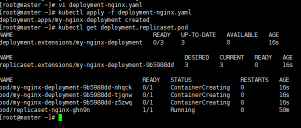


2. **디플로이먼트 삭제 => 레플리카셋, 포드도 함께 삭제되는 것을 확인**

```
kubectl delete deployment my-nginx-deployment
```

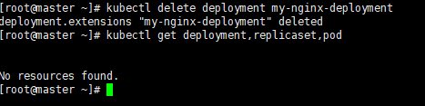


---

#### 디플로이먼트를 사용하는 이유

----

어플리케이션의 업데이트와 배포를 편하게 만들기 위해서 사용

버전업그레이드 하면 하나씩 알아서 바꿔줌


1. **--record 옵션을 추가해서 디플로이먼트를 생성**

```
kubectl apply -f deployment-nginx.yaml --record
```


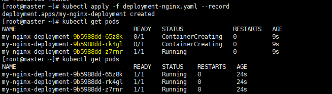


2. **kubectl set image 명령으로 포드의 이미지를 변경**

```
kubectl set image deployment my-nginx-deployment nginx=nginx:1.11 --record
```


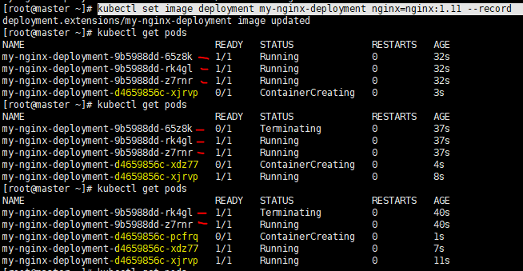

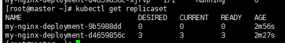

* 처음에 생성했던 레플리카셋과 나중에 생성한 레플리카셋


3. **리비전 정보 확인**

```
kubectl rollout history deployment my-nginx-deployment
```

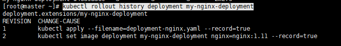


4. **이전 비전의 레플리카셋으로 롤백**

```
kubectl rollout undo deployment my-nginx-deployment --to-revision=1
```

* undo : 바로 이전
* --to-revision: 특정 버전으로 이동시 사용

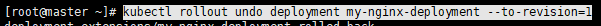

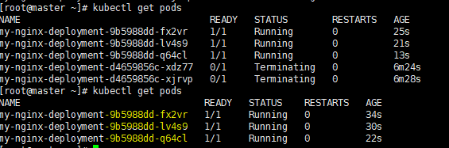

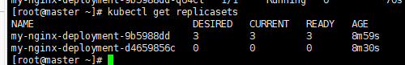

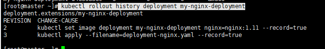


5. **디플로이먼트 상세 정보를 출력**

```
kubectl describe deployment my-nginx-deployment
```


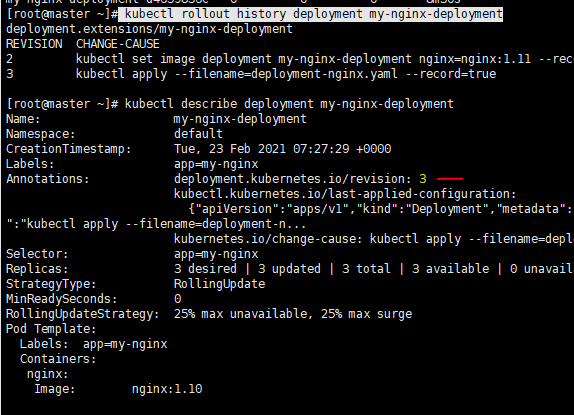

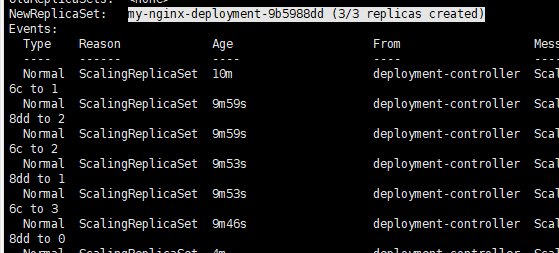


6. **모든 리소스를 삭제**

```
kubectl delete deployment,replicaset,pod --all
```


---

#### 리비전을 여러개 했을 때

----

**여러개 버전의 디플로이먼트 생성**

```
kubectl apply -f deployment-nginx.yaml --record
```

```
kubectl set image deployment my-nginx-deployment nginx=nginx:1.11 --record
```

```
kubectl set image deployment my-nginx-deployment nginx=nginx:1.12 --record
```

```
kubectl set image deployment my-nginx-deployment nginx=nginx:1.13 --record
```

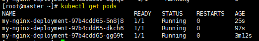

* 1.13 버전의 pod상태

```
kubectl rollout history deployment my-nginx-deployment
```

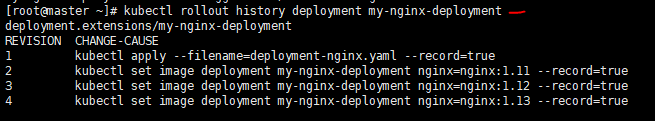


**이전상태로 돌리기**

```
kubectl rollout undo deployment my-nginx-deployment
```

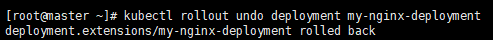

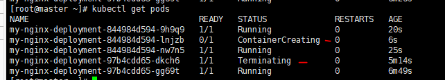

* 기존의 파드 Terminating되고 1.12버전의 파드들이 생성되고있음

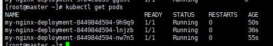

* undo: 바로 이전상태로


```
kubectl rollout history deployment my-nginx-deployment
```

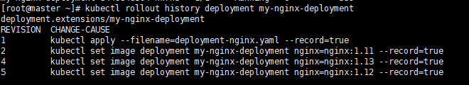


 **특정 버전으로 돌리기**

```
kubectl rollout undo deployment my-nginx-deployment --to-revision=1
```

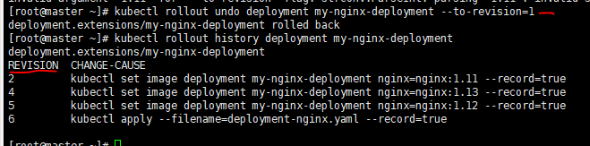

* --to-revision: 버전정보가 아니라 history에서 revision 정보


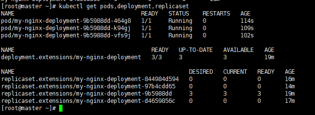

* pod, deployment, replicaset 확인


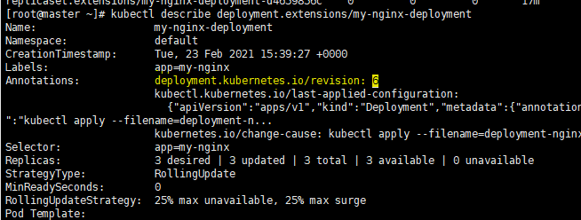

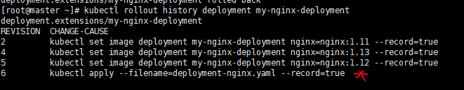

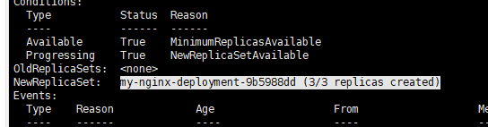

* 현재 디플로이먼트 상태 확인, 


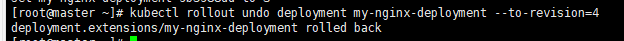

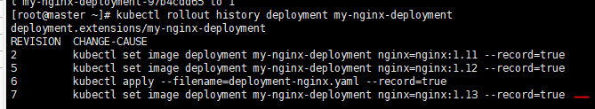

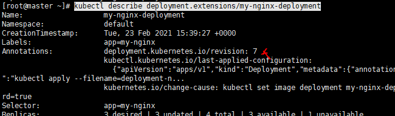

* revision 바뀐거 확인

