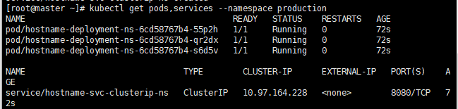

## Namespace

- 쿠버네티스 클러스터 안의 가상 클러스터

- 포드, 레플리카셋, 디플로이먼트, 서비스 등과 같은 쿠버네티스 리소스들이 묶여있는 하나의 가상 공간 또는 그룹

- 리소스를 논리적으로 구분하기 위한 오브젝트


**네임스페이스 생성, 조회**

```
kubectl get namespaces 
```

```
NAME              STATUS   AGE
default           Active   7d21h <== 자동으로 제공되는 네임스페이스
kube-node-lease   Active   7d21h  
kube-public       Active   7d21h <== 자동으로 제공됨
kube-system       Active   7d21h <== 자동으로 제공됨
```


* 네임스페이스 안에는 오브젝트들이 따로따로 존재한다.


**특정 네임스페이스에 생성된 오브젝트를 확인**

```
kubectl get pods
```


* 네임스페이스를 지정하지 않으면 기본적으로 default 네임스페이스를 사용

```
kubectl get pods --namespace default
```


* default를 지정해서


```
kubectl get pods --namespace kube-system
```


* kube-system 네임스페이스의 파드 조회
* kube-system: 쿠버네티스 클러스터 구성에 필수적인 컴포넌트와 설정값이 존재하는 네임스페이스


```
kubectl get services -n kube-system
```


* kube-system 서비스를 조회

----


**네임스페이스 생성, 확인**

1. **yaml 작성**

```
vi production-namespace.yaml
```

```yaml
apiVersion: v1
kind: Namespace
metadata:
  name: production

```

* production :  namespace로 주로 구분하는 것은 개발용, 배포 준비단계용, 실제 배포용, 운영용 등으로 구분된다. production이므로 서비스 배포용으로 만들때로 구분한 production

  

2. **네임스페이스 생성**

```
kubectl apply -f production-namespace.yaml
```


```
kubectl create namespace mynamespace
```


```
kubectl get namespaces
```


3. **특정 네임스페이스에 리소스를 생성하는 방법**

```
vi hostname-deploy-svc-ns.yaml
```

```yaml
apiVersion: apps/v1
kind: Deployment
metadata:
  name: hostname-deployment-ns
  namespace: production
spec:
  replicas: 3
  selector:
    matchLabels:
      app: webserver
  template:
    metadata:
      name: my-webserver
      labels:
        app: webserver
    spec:
      containers:
      - name: my-webserver
        image: alicek106/rr-test:echo-hostname
        ports:
        - containerPort: 80
---
apiVersion: v1
kind: Service
metadata:
  name: hostname-svc-clusterip-ns
  namespace: production
spec:
  ports:
    - name: web-port
      port: 8080
      targetPort: 80
  selector:
    app: webserver
  type: ClusterIP

```

* 메타데이터에 namespace 정의됨


```
kubectl apply -f hostname-deploy-svc-ns.yaml
```


```
kubectl get pods,services --namespace production
```



* yaml 파일로 deployment, service 생성함, 확인


4. **모든 네임스페이스의 리소스를 확인**

```
kubectl get pods --all-namespaces
```


5. **동일 네임스페이스 내의 포드에 접근**

```
kubectl get services --namespace production
```


* 서비스 이름, ip주소 확인

```
kubectl run -it --rm debug --image=alicek106/ubuntu:curl --restart=Never --namespace=production -- bash
```

```
root@debug:/# curl 10.97.164.228:8080
```


* ip접근 가능

```
root@debug:/# curl hostname-svc-clusterip-ns:8080
```


* 서비스네임 접근 가능


6. **다른 네임스페이스 내의 서비스에 접근**

```
[vagrant@master ~]$ kubectl run -it --rm debug --image=alicek106/ubuntu:curl --restart=Never -- bash	
```

* 네임스페이스를 지정하지 않고(=default 네임스페이스)포드를 생성

```
root@debug:/# curl 10.109.85.128:8080
```

* ip로 접근 가능 : 네임스페이스가 달라도 접근은 할 수 있다


```
root@debug:/# curl hostname-svc-clusterip-ns:8080
```


- 네임스페이스가 다르면 서비스네임만으로는 접근할 수 없다.

  

다른 네임스페이스에 존재하는 서비스로 접근하기 위해서는 규칙이 

[서비스이름].[네임스페이스이름].svc 형태로 사용

```
root@debug:/# curl hostname-svc-clusterip-ns.production.svc:8080
```


7. **네임스페이스 삭제**

```
kubectl delete namespace mynamespace
```

```
kubectl delete -f production-namespace.yaml
```

```
kubectl get namespaces
```


---

**네임스페이스에 속하는 오브젝트 종류**

```
[vagrant@master ~]$ kubectl api-resources --namespaced=true
```


* 등등


**네임스페이스에 속하지않는 오브젝트 종류**

```
[vagrant@master ~]$ kubectl api-resources --namespaced=false
```

* 클러스터 전반에 사용되는 경우가 많음

