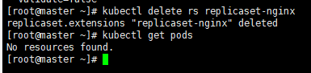
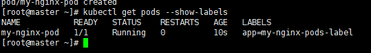
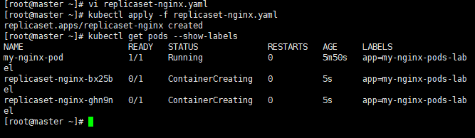
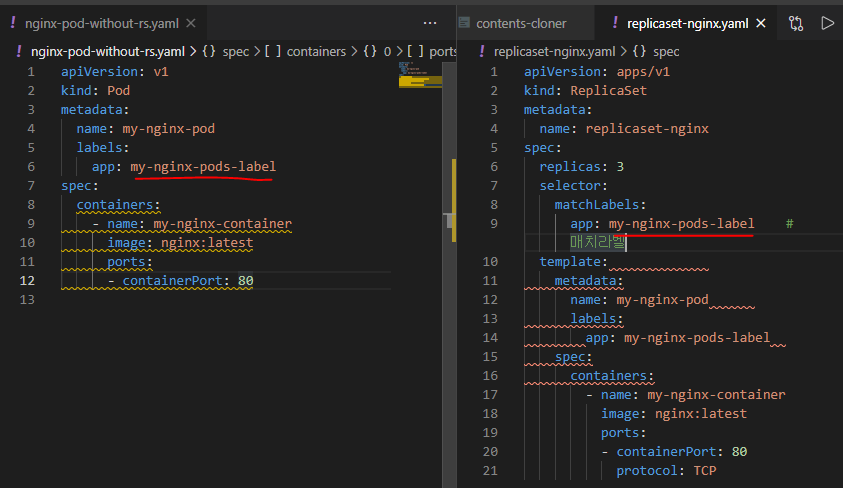
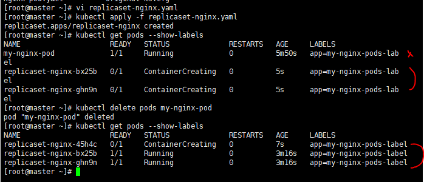
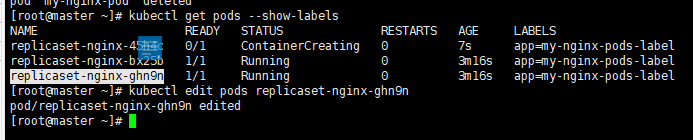
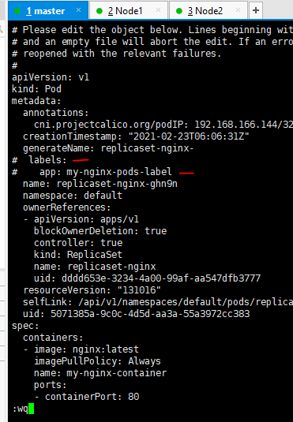
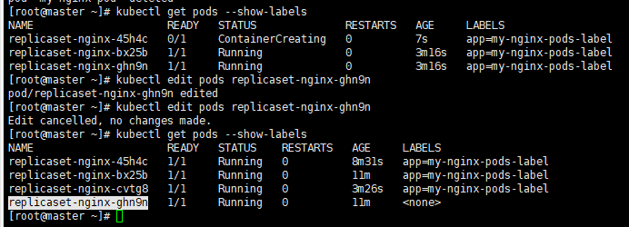
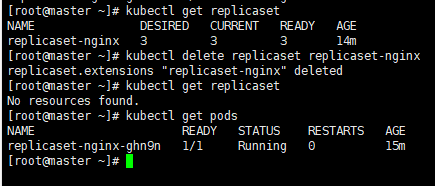

## 레플리카셋(replicaset)

정해진 수의 동일한 포드가 항상 실행되도록 관리

노드 장애등의 이유로 포드를 사용할 수 없다면, 다른 노드에서 포드를 다시 생성


#### 레플리카셋 생성 및 삭제

---


1. **기존에 생성한 리소스 정리**

```
kubectl get pod
kubectl delete -f hc-probe.yaml
```


2. **nginx 컨테이너 두개를 실행하는 포드를 정의**

```yaml
apiVersion: v1
kind: Pod
metadata:
  name: my-nginx-pod-a
spec:
  containers:
  - name: my-nginx-container
    image: nginx
    ports:
    - containerPort: 80
      protocol: TCP
---
apiVersion: v1
kind: Pod
metadata:
  name: my-nginx-pod-b
spec:
  containers:
  - name: my-nginx-container
    image: nginx
    ports:
    - containerPort: 80
      protocol: TCP
```

* 동일한 포드를 일일이 정의하는 것은 매우 비효율적
* 포드가 삭제되거나, 포드가 위치한 노드에 장애가 발생해서 포드에 접근할 수 없는 경우에는 관리자가 직접 포드를 삭제하고 다시 생성해야하는 문제가 있다.
* 이런거를 개선하기 위해서 레플리카셋 사용
* 내가 만든 포드를 노드에 분산시켜서 관리해주는 것이 레플리카셋


3. **레플리카셋을 정의**

replicaset-nginx.yaml

```
[vagrant@master ~]$ vi replicaset-nginx.yaml
```

```yaml
apiVersion: apps/v1
kind: ReplicaSet
metadata:
  name: replicaset-nginx
spec:
  replicas: 3
  selector:
    matchLabels:
      app: my-nginx-pods-label		# 매치라벨
  template:							# 레플리카셋에서 필요로하는 내용을 담음, 포드 스펙, 포드 템플릿 --> 생성할 포드를 명시
    metadata:
      name: my-nginx-pod			# 컨테이너로 구성
      labels:
        app: my-nginx-pods-label	
    spec:
      containers:
        - name: my-nginx-container
          image: nginx:latest
          ports:
          - containerPort: 80
            protocol: TCP

```


4. **레플리카셋을 생성**

```
kubectl apply -f replicaset-nginx.yaml
```

```
kubectl get pods,replicaset
```


5. **포드 개수를 증가시킨 후 실행**

```
cp replicaset-nginx.yaml replicaset-nginx-4pods.yaml
```

```
vi replicaset-nginx-4pods.yaml
```

```
kubectl apply -f replicaset-nginx-4pods.yaml
```

```
replicaset.apps/replicaset-nginx configured		⇐ 기존 리소스를 수정 (포드 개수를 3개에서 4개로 조정)

[vagrant@master ~]$ kubectl get pods
NAME                     READY   STATUS    RESTARTS   AGE
hello-pod                1/1     Running   2          3d21h
nginx-test               1/1     Running   4          4d4h
pod-1                    2/2     Running   6          3d22h
replicaset-nginx-dkw42   1/1     Running   0          32m
replicaset-nginx-hftsb   1/1     Running   0          32m
replicaset-nginx-jmqff   1/1     Running   0          7s
replicaset-nginx-srcwq   1/1     Running   0          32m

```


6. **레플리카셋을 삭제**

```
[vagrant@master ~]$ kubectl delete rs replicaset-nginx
```

* 레플리카 셋으로 생성한 포드도 함께 삭제




#### 레플리카셋 동작원리

1. **레플리카 셋을 사용하지 않는 포드를 정의 후 생성**

```
[vagrant@master ~]$ vi nginx-pod-without-rs.yaml
```

```yaml
apiVersion: v1
kind: Pod
metadata:
  name: my-nginx-pod
  labels:
    app: my-nginx-pods-label
spec:
  containers:
    - name: my-nginx-container
      image: nginx:latest
      ports:
      - containerPort: 80
```

```
kubectl apply -f nginx-pod-without-rs.yaml
```

```
kubectl get pods --show-labels
```




2. **app: my-nginx-pods-label 라벨을 가지는 포드를 3개 생성하는 레플리카셋**

```
[root@master ~]# vi replicaset-nginx.yaml
```

```
[root@master ~]# kubectl apply -f replicaset-nginx.yaml
```



* 라벨을 기준으로 포드를 관리한다.

* 동일한 라벨의 포드가 이미 생성되어있다면 레플리카로 생성하더라도 동일한 라벨이 있다면 그것을 제외한 갯수만큼 새로 만들어준다.





3. **1번 이어서 수동으로 생성한 포드를 삭제**

```
# 1번에서 만든 포드 my-nginx-pod
```

```
kubectl delete pods my-nginx-pod
```



* 레플리카 셋이 새로운 pod를 생성해줌


4. **레플리카셋이 생성한 포드의 라벨을 변경해보면?**

```
kubectl edit pods [replicaset-nginx-ghn9n]
```









* 라벨을 지우니까 새로운 pod가 생성됬음
* 라벨이 없기때문에 관리대상으로 간주하지 않는다.


5. **레플리카셋을 삭제**

```
kubectl delete replicaset replicaset-nginx
```



* 레플리카셋 삭제하면 레플리카셋에 의해 관리되던 pod도 삭제된다.

