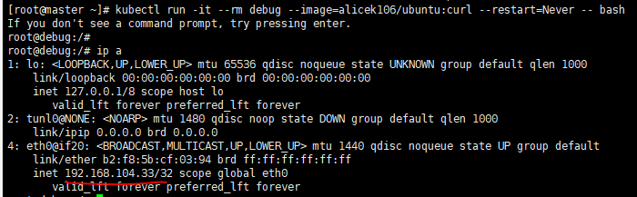
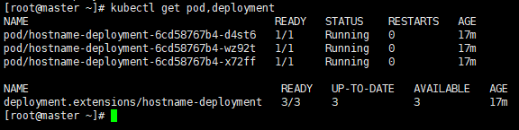

## 서비스 (Service)

포드를 연결하고 외부에 노출시키는 역할

YAML 파일에 containerPort 항목을 정의했다고 해서 해당 포트가 바로 외부에 노출되는 것은 아님

해당 포트로 사용자가 접근하거나, 다른 디플로이먼트의 포드들이 내부적으로 접근하려면 서비스(Service) 객체가 필요


**서비스의 기능**

- 여러 개의 포드에 쉽게 접근할 수 있도록 고유한 도메인 이름을 부여
- 여러 개의 포드에 접근할 때, 요청을 분산하는 로드 밸런싱
- 클라우드 플랫폼의 로드 밸런서, 클러스터 노드의 포트 등을 통해 포드를 외부에 노출 


**서비스의 종류(type)**

ClusterIP 타입

- 쿠버네티스 내부에서만 포드들에 접근할 때 사용
- 외부로 포드를 노출하지 않기 때문에 쿠버네티스 클러스터 내부에서만 사용되는 포드에 적합

NodePort 타입

- 포드에 접근할 수 있는 포트를 클러스터의 모든 노드에 동일하게 개방
- 외부에서 포드에 접근할 수 있는 서비스 타입
- 접근할 수 있는 포트는 랜덤으로 정해지지만, 특정 포트로 접근하도록 설정할 수 있음

LoadBalancer 타입

- 클라우드 플랫폼에서 제공하는 로드 밸런서를 동적으로 프로비저닝해 포드에 연결

- NodePort 타입과 마찬가지로 외부에서 포드에 접근할 수 있는 서비스 타입

- 일반적으로 AWS, GCP과 같은 클라우드 플랫폼 환경에서 사용

  

---

##### 디플로이먼트를 생성

---

1. **디플로이먼트 정의, 생성, 확인**

```
[vagrant@master ~]$ vi deployment-hostname.yaml
```

```yaml
apiVersion: apps/v1
kind: Deployment
metadata:
  name: hostname-deployment
spec:
  replicas: 3
  selector:
    matchLabels:
      app: webserver
  template:
    metadata:
      name: my-webserver
      labels:
        app: webserver
    spec:
      containers:
        - name: my-webserver
          image: alicek106/rr-test:echo-hostname # 컨테이너의 호스트 이름을 반환하는 웹 서버 이미지
          ports:
          - containerPort: 80

```


2. **클러스터 노드 중 하나에 접속해서 curl을 이용해 포드에 접근**

```
kubectl run -i --tty --rm debug --image=alicek106/ubuntu:curl --restart=Never curl 192.168.166.173 | grep Hello
```


---

#### ClusterIP 타입의 서비스 - 쿠버네티스 클러스터 내부에서만 포드에 접근

---

1. **hostname-svc-clusterip.yaml 파일을 생성**

```
[vagrant@master ~]$ vi hostname-svc-clusterip.yaml
```

```yaml
apiVersion: v1
kind: Service
metadata:
  name: hostname-svc-clusterip
spec:
  ports:
  - name: web-port
    port: 8080				# 서비스의 IP에 접근할 때 사용할 포트				
    targetPort: 80			# selector 항목에서 정의한 라벨의 포드의 내부에서 사용하고 있는 포트
  selector:
    app: webserver			# 셀렉터는 포드를 지정, 내부 80포트로 매핑
  type: ClusterIP			# 서비스 타입

```


2. **서비스 생성 및 확인**

```
kubectl apply -f hostname-svc-clusterip.yaml
```

```
kubectl get services
```


3. **임시 포드를 생성해서 서비스로 요청**

```
kubectl run -it --rm debug --image=alicek106/ubuntu:curl --restart=Never -- bash
```




```
curl 10.99.83.212:8080 --silent | grep Hello
```

* host


* 파드 3개 잡힘


4. **서비스 이름으로 접근**


* 서비스 이름으로도 요청 가능



* 위에서 일을하던 파드확인


5. **서비스 삭제**


* 서비스 삭제해도 파드나 디플로이먼트는 삭제가 되지 않음


**서비스??**

* ip를 이용할 필요가없다
* 서비스는 이름이있기때문에 서비스 이름으로 접근이 가능하다.
* 이렇게 되는이유
  *  쿠버네티스는 어플리케이션이 서비스나 포드를 쉽게 찾을 수 있도록 내부 DNS를 구동하고 있기때문에 가능
  * 이름을 ip로 바꿔주는 것을 DNS
  * ip는 동적으로 계속 바뀌기 때문에 이름으로 하는게 좋다


