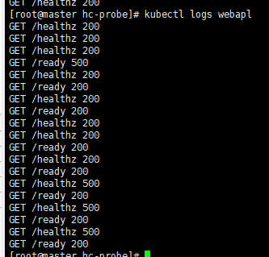

## Pod의 Health Check 기능

헬스체크: 포드의 컨테이너에는 어플리케이션이 정상적으로 동작하고 있는지 확인하는 기능이 있다

* 헬스체크 결과, 이상이 감지되는 경우, 컨테이너를 강제 종료하고 재시작할 수 있음

* kubelet이 컨테이너의 헬스 체크를 담당
  * 활성 프로브(Liveness Probe)
    * 컨테이너의 어플리케이션이 정상적으로 실행 중 인 것을 검사
    * 검사에 실패하면 포드상의 컨테이너를 강제로 종료하고 재시작
    * 매니페스트에 명시적으로 설정해야 사용할 수 있음
  * 준비 상태 프로브(Reading Probe)
    * 컨테이너의 어플리케이션이 요청을 받을 준비가 되었는지 검사
    * 검사에 실패하면 서비스에 의한 요청 트래픽 전송을 준비
    * 포드가 기동되고 나서 준비가 될 때까지 요청이 전송되지 않도록 하기 위해 사용
    * 매니페스트(manifest, ex yaml)에 명시적으로 설정해야 사용할 수 있음


1. **작업 디렉토리 생성 후 매니페스트 파일(YAML) 작성**

hc-probe.yaml

```yaml
apiVersion: v1
kind: Pod
metadata:
  name: webapl
spec:
  containers:
    - name: webapl
      image: upi907/webapl:0.1	# 핸들러를 구현한 어플리케이션
      livenessProbe:				# 어플리케이션 동작하는지 확인
        httpGet:					# 지정된 포트와 경로로 HTTP GET 요청을 주기적으로 실행
          path: /healthz			# 확인 경로
          port: 3000				# 확인 포트
        initialDelaySeconds: 3		# 검사 개시 대기시간 (파트 실행하고 3초지나면 해당 어플리케이션이 동작하는지 확인하는거야)
        periodSeconds: 5			# 검사 주기 
      readinessProbe:				# 어플리케이션이 준비되었는지 확인
        httpGet:					
          path: /ready
          port: 3000
        initialDelaySeconds: 15
        periodSeconds: 6

```


2. **(어플리케이션에서 사용할)컨테이너 이미지를 생성**

```
[root@master hc-probe]# vi Dockerfile
```

```dockerfile
FROM alpine:latest

RUN apk update && apk add --no-cache nodejs npm

WORKDIR /
ADD ./package.json /
RUN npm install
ADD ./webapl.js /

CMD node /webapl.js

```

webapl.js라는 파일을 컨테이너에 넣었고


package.json

```json
{
    "name": "webapl",
    "version": "1.0.0",
    "description": "",
    "main": "webapl.js",
    "scripts": {
      "test": "echo \"Error: no test specified\" && exit 1"
    },
    "author": "",
    "license": "ISC",
    "dependencies": {
      "express": "^4.16.3"
    }
  }
```

express: 웹서버 모듈과 함께 webapl.js라는 파일을 실행시켜줌


webapl.json

```js
//  웹 어플리케이션 
const express = require('express')
const app = express()
var start = Date.now() // 어플리케이션이 시작된 시간

//  http://CONTAINER_IP:3000/healthz 형식으로 요청이 들어왔을 때 수행하는 기능을 정의하는 함수
app.get('/healthz', function(request, response) {
    var msec = Date.now() - start //어플리케이션 현지시간 - 시작시간 = 경과시간
    var code = 200
    if (msec > 40000 ) {		// 경과된 시간이 4000ms보다 작으면 200리턴, 크면 응답코드로 500 반환
    code = 500
    }
    console.log('GET /healthz ' + code)
    response.status(code).send('OK')
})

app.get('/ready', function(request, response) { // ready도 경과된 시간을 봄
    var msec = Date.now() - start
    var code = 500
    if (msec > 20000 ) {
    code = 200
    }
    console.log('GET /ready ' + code)
    response.status(code).send('OK')
})

app.get('/', function(request, response) {
    console.log('GET /')
    response.send('Hello from Node.js')
})

app.listen(3000);

```


3. **컨테이너 이미지 생성 후 도커 허브에 등록**

```
[root@master hc-probe]$ docker build --tag upi907/webapl:0.1 .

[root@master hc-probe]$ docker push upi907/webapl:0.1 
```


4. **포드를 배포하고 헬스체크 기능을 확인**

```
[root@master hc-probe]$ kubectl apply -f webapl-pod.yaml
```

```
[root@master hc-probe]$ kubectl get pods
```




* healthz 가 500을 반환하는 케이스: 40초 이상이 지나면 500반환

* 시간 경과뒤에 `kubectl get pod -o wide`로 확인하면 포드가 재실행되는 것을 확인할 수 있음