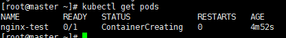

#### 에러상황 모음

---

1. **`kubectl get pods` 했을때, Pending 상태가 지속되는 경우**

---


```
systemctl status kubelet
```


* 사용하는 다른 노드에서 kubelet의 상태를 확인 => inactive 상태인경우!


```
systemctl restart kubelet
```

* 사용하는 노드에서 kubelet을 restart시킨다.





* 해결!